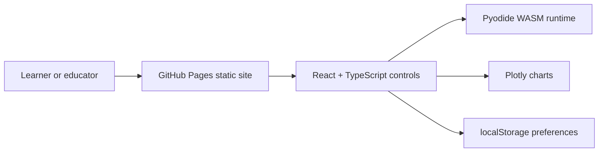

# Stellar Evolution Simulator


Live site:

https://baditaflorin.github.io/stellar-evolution-simulator/

Repository:

https://github.com/baditaflorin/stellar-evolution-simulator

Support:

https://www.paypal.com/paypalme/florinbadita

Browser-based stellar lifecycle simulator using Pyodide, Plotly, and a MESA-inspired model subset. Enter stellar mass, run the in-browser Python model, watch the compressed lifecycle animation, and inspect HR/time-series plots for radius, luminosity, and temperature.


## Quickstart

```sh
make install
make install-hooks
make dev
make test
make smoke
```

## What V1 Does

- Runs fully on GitHub Pages with no runtime backend, secrets, accounts, or database.
- Lazy-loads Pyodide only when a simulation starts.
- Lazy-loads Plotly only when chart data exists.
- Shows the GitHub repository link, PayPal support link, version, and release commit in the UI.
- Ships a PWA manifest and service worker for the static shell.

## Architecture



Architecture notes:

docs/architecture.md

ADRs:

docs/adr/

Deployment guide:

docs/deploy.md

Privacy:

docs/privacy.md

## Development

```sh
make help
make dev
make lint
make test
make build
make smoke
```

`make build` writes the GitHub Pages-ready static site into `docs/`. The repository is configured for GitHub Pages from `main` branch `/docs`.

## Release

```sh
make lint
make test
make smoke
git tag v0.1.0
git push origin v0.1.0
```

## Security

No secrets are required. Do not commit `.env` files, private keys, API tokens, or credentials. Local hooks run linting, type checks, conventional commit validation, and `gitleaks` scanning.

## License

MIT
