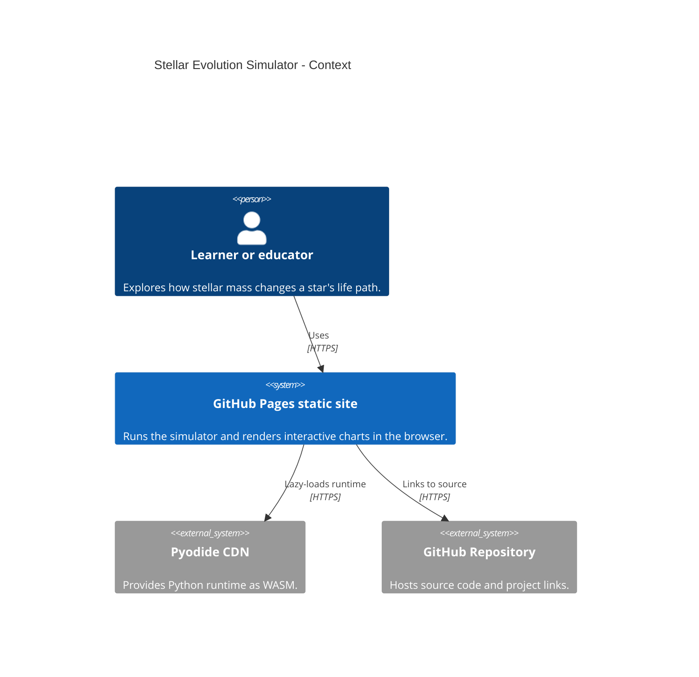
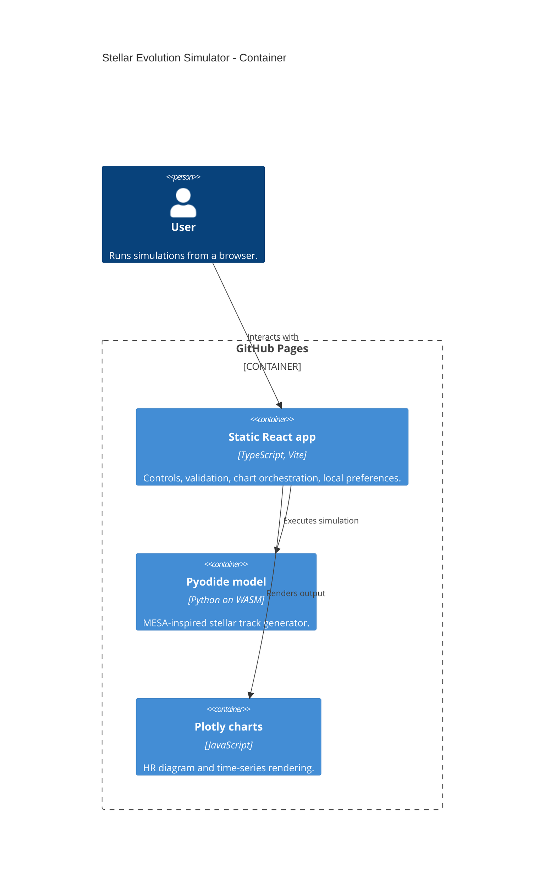

# Architecture

## Context

```mermaid
C4Context
  title Stellar Evolution Simulator - Context
  Person(user, "Learner or educator", "Explores how stellar mass changes a star's life path.")
  System(site, "GitHub Pages static site", "Runs the simulator and renders interactive charts in the browser.")
  System_Ext(pyodide, "Pyodide CDN", "Provides Python runtime as WASM.")
  System_Ext(github, "GitHub Repository", "Hosts source code and project links.")
  Rel(user, site, "Uses", "HTTPS")
  Rel(site, pyodide, "Lazy-loads runtime", "HTTPS")
  Rel(site, github, "Links to source", "HTTPS")
```

## Container

```mermaid
C4Container
  title Stellar Evolution Simulator - Container
  Person(user, "User", "Runs simulations from a browser.")
  Container_Boundary(pages, "GitHub Pages") {
    Container(app, "Static React app", "TypeScript, Vite", "Controls, validation, chart orchestration, local preferences.")
    Container(py, "Pyodide model", "Python on WASM", "MESA-inspired stellar track generator.")
    Container(charts, "Plotly charts", "JavaScript", "HR diagram and time-series rendering.")
  }
  Rel(user, app, "Interacts with")
  Rel(app, py, "Executes simulation")
  Rel(app, charts, "Renders output")
```

GitHub Pages serves only static files from `docs/`. No runtime backend exists in v1.
